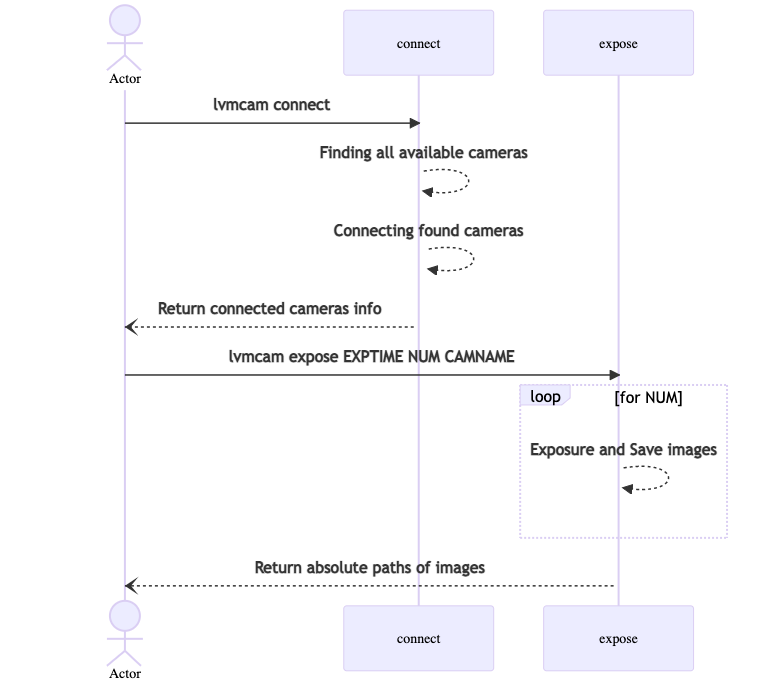

.. _structure:

Structure
===========

Current fits header
--------------------
.. code-block:: console

    $ clu
    lvmcam expose -r 00h42m44s -d 41d16m09s -K 10 -f 1800 0.5 3 sci.agw
    00:37:43.916 lvmcam > 
    00:37:47.262 lvmcam : {
        "PATH": {
            "0": "/home/mgjeon/lvmcam/python/lvmcam/assets/lvm/sci/agw/20211203/lvm.sci.agw-00000001.fits",
            "1": "/home/mgjeon/lvmcam/python/lvmcam/assets/lvm/sci/agw/20211203/lvm.sci.agw-00000002.fits",
            "2": "/home/mgjeon/lvmcam/python/lvmcam/assets/lvm/sci/agw/20211203/lvm.sci.agw-00000003.fits"
        }
    }
    
The current headers of fits file are as follows.

.. code-block:: console

    SIMPLE  =                    T / conforms to FITS standard                      
    BITPIX  =                   16 / array data type                                
    NAXIS   =                    3 / number of array dimensions                     
    NAXIS1  =                 1600                                                  
    NAXIS2  =                 1100                                                  
    NAXIS3  =                    1                                                  
    EXTEND  =                    T                                                  
    BSCALE  =                    1                                                  
    BZERO   =                32768                                                  
    CAMNAME = 'sci.agw '           / Camera name                                    
    CAMUID  =             19283193 / Camera UID                                     
    IMAGETYP= 'object  '           / The image type of the file                     
    EXPTIME =                  0.5 / Exposure time of single integration [s]        
    DATE-OBS= '2021-12-03T00:38:23.151' / Date (in TIMESYS) the exposure started    
    PXFORMAT= 'Mono16  '           / Pixel format                                   
    FULLFRAM= '1608x1104'          / Full Frame                                     
    ROI     = '1600x1100 at 0,0'   / ROI                                            
    FRAMSIZE=              3520000 / Frame size (Bytes)                             
    FRAMRATE=    3.392067663337556 / Frame rate (Hz)                                
    EXPTIME =   0.5000019999999999 / Exposure time (seconds)                        
    GAINCONV= 'LCG     '           / Gain Conv.                                     
    GAMMAENA=                    F / Gamma Enable                                   
    GAMMAVAL=       0.800048828125 / Gamma Value                                    
    ACQUIMOD= 'SingleFrame'        / Acquisition mode                               
    FRMRATBD= '(min=1.0, max=3.3953648380635064)' / Framerate bounds                
    EXPTIMBD= '(min=14.0, max=30000003.0)' / Exp. time bounds                       
    GAINBD  = '(min=0.0, max=47.994294033026364)' / Gain bounds                     
    VOLTAGE =        9.75341796875 / Power Supply Voltage (V)                       
    CURRENT =        0.28271484375 / Power Supply Current (A)                       
    POWER   =     1.46920382976532 / Total Dissiapted Power (W)                     
    CAMTEMP =               33.375 / Camera Temperature (C)                         
    CUNIT1  = 'deg     '           / WCS units along axis 1                         
    CUNIT2  = 'deg     '           / WCS units along axis 2                         
    CTYPE1  = 'RA---TAN'           / WCS type axis 1                                
    CTYPE2  = 'DEC--TAN'           / WCS type axis 2                                
    CRVAL1  =    10.68333333333333 / [deg] RA at reference pixel                    
    CRVAL2  =    41.26916666666666 / [deg] DEC at reference pixel                   
    CD1_1   = -9.7981553605101E-05 / [deg/px] WCS matrix diagonal                   
    CD2_2   = 9.79815536051017E-05 / [deg/px] WCS matrix diagonal                   
    CD1_2   = -0.00026920210605309 / [deg/px] WCS matrix outer diagonal             
    CD2_1   = -0.00026920210605309 / [deg/px] WCS matrix outer diagonal             
    CHECKSUM= '9HDAHH969HCAEH95'   / HDU checksum updated 2021-12-03T09:37:47       
    DATASUM = '916223505'          / data unit checksum updated 2021-12-03T09:37:47 
    END                                                                             

The above headers are created by different sources such as sdss/basecam, sdss/araviscam, and sdss/LVM_FLIR_Software.

Current rule of fits file name
-------------------------------

The rule is ``filepath/dirname/basename``.

.. code-block:: console

    $ clu
    lvmcam expose -r 00h42m44s -d 41d16m09s -K 10 -f 1800 0.5 3 sci.agw
    00:37:43.916 lvmcam > 
    00:37:47.262 lvmcam : {
        "PATH": {
            "0": "/home/mgjeon/lvmcam/python/lvmcam/assets/lvm/sci/agw/20211203/lvm.sci.agw-00000001.fits",
            "1": "/home/mgjeon/lvmcam/python/lvmcam/assets/lvm/sci/agw/20211203/lvm.sci.agw-00000002.fits",
            "2": "/home/mgjeon/lvmcam/python/lvmcam/assets/lvm/sci/agw/20211203/lvm.sci.agw-00000003.fits"
        }
    }

.. code-block:: console
  
  # cameras.yaml
  cameras:
    sci.agw:
      name: "sci.agw"
      ...
      path:
            basename: "lvm.{camera.name}-{num:08d}.fits"
            dirname: "lvm/sci/agw/{date.strftime('%Y%m%d')}"
            filepath: "python/lvmcam/assets"

About files 
-----------

Cameras setting file is ``lvmcam/python/lvmcam/etc/cameras.yaml``.

Default file path where images are saved is  ``lvmcam/python/lvmcam/assets/...``.
    

Sequence diagram of lvmcam
--------------------------

Development
-----------
For developing lvmcam, you can start lvmcam by typing commands below.

Debug mode

.. code-block:: console 

    $ lvmcam start --debug

Normal mode

.. code-block:: console 

    $ lvmcam start 
    $ lvmcam stop 

If you want to build lvmcam docker package, use following command.

.. code-block:: console 

    $ poetry run container_build --no-cache

If you want to make lvmcam document page, use following commands.

.. code-block:: console 

    $ cd docs/sphinx/
    $ make html